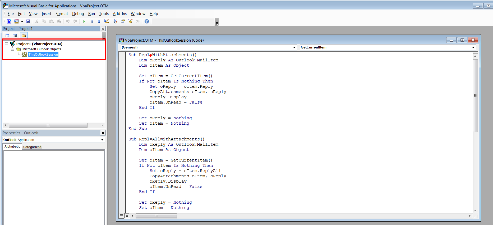
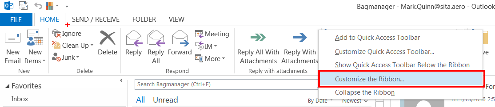
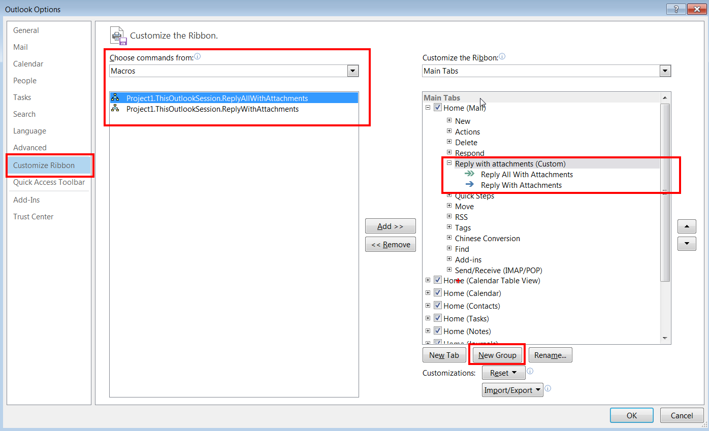
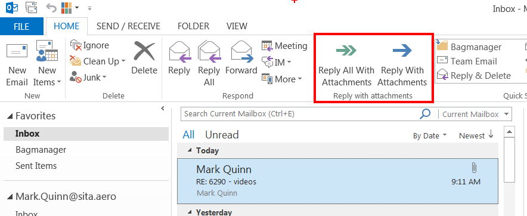

# OutlookReplyAllWithAttachments

Here you will find a macro and instructions on how to add a "Reply to all with attachments" button to Microsoft Outlook 2013. 

We recently started using Outlook 2013 at work but it annoyingly does not have a button where you can reply to a email and keep any attachments which may exist. You need to either save the attachments and reattach or forward the email and add all the receipient addresses again.

####Pre-requisites
Microsoft Outlook 2013

##Steps
1. Press ATL-F11. This will open the VB editor
. 

2. Copy the code found [here](replyToAllWithAttachments.vb) into the “ThisOutlookSession” pane.
3. In your main window -> Right click on the top ribbon and select “Customize Ribbon”.

4. Create a new custom group. I have created it on my Home tab but you can create it wherever you want. 

5. Choose macros from the drop down and add the 2 macros you have created to the group.
6. Rename the macros inside your custom group and give whatever icons you want to the macros and save.
7. In your main window you now should have a new button group with 2 buttons 

8. Make sure your Outlook 2013 security settings are enabled to run macros. Click on the **File** tab, choose **Outlook Options** to open the Outlook Options dialog box, and then click **Trust Center**.

9. Click **Trust Center Settings**, and then the **Macro Settings** option on the left.

10. Select **Enable All Macros**. You can choose another option here if you want more security enabled.

11. Restart Outlook for the configuration change to take effect

12. Test it out!

####References
- [Getting starting with VBA in Outlook](https://msdn.microsoft.com/en-us/library/ee814736.aspx)
- [Reply to all with attachments](http://www.slipstick.com/outlook/email/reply-replyall-attachments/)
